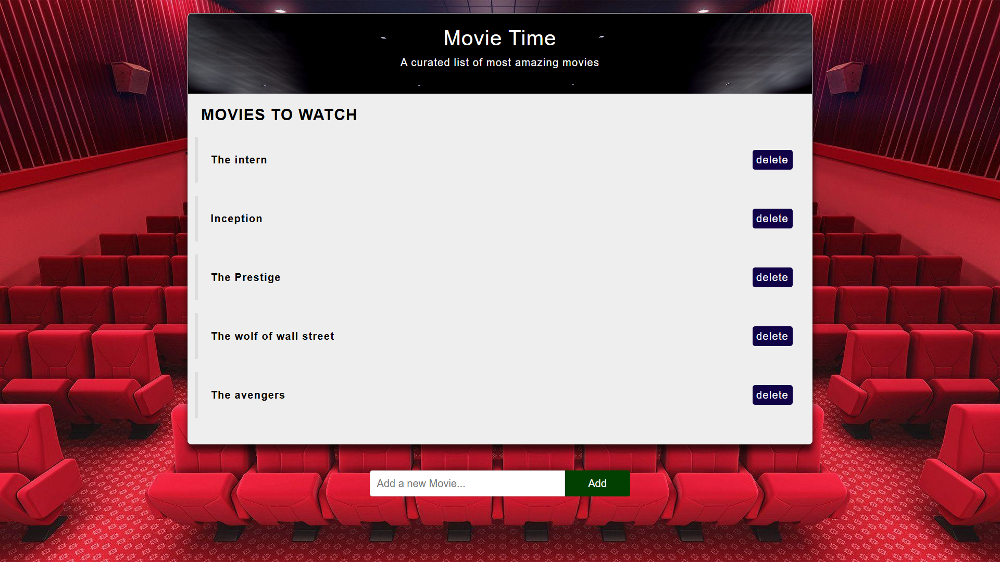
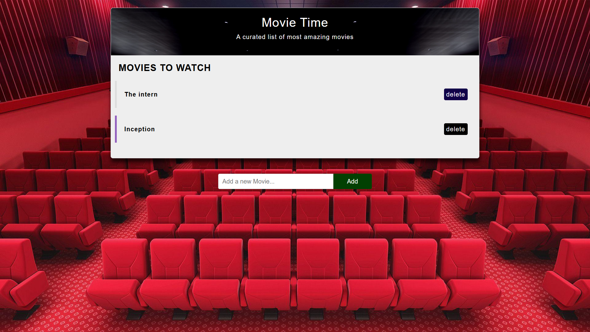
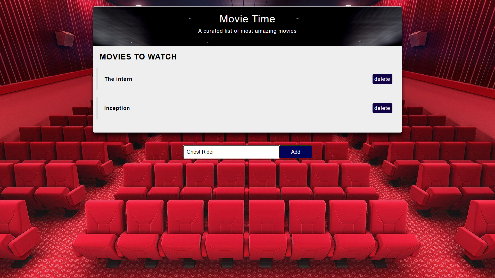
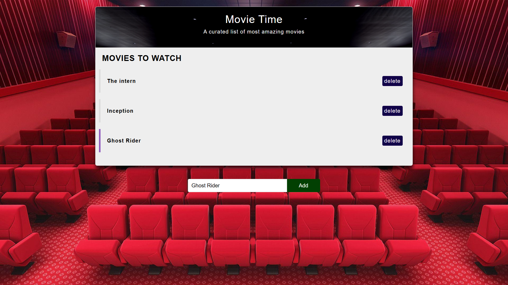

# 🎬 Movie_Time
A simple movie list web app where you can add and delete movies you want to watch.

## 🌟 Features  
- Add movies to your watchlist  
- Remove movies from the list  
- Simple and clean UI with a stylish design  
- Built using HTML, CSS, and JavaScript  

## 🚀 Technologies Used  
- HTML  
- CSS  
- JavaScript  

## 🎥 How to Use  
1. Open the project in a browser.  
2. Add a movie by typing its name and clicking "Add."  
3. Click "delete" to remove a movie from the list.  

Enjoy managing your movie watchlist! 🎞️🍿  

--------------------------------------------------------

Full Page Image  ------------------

 

*******************************************************************************************************************************************************

Delete Movie from list  -------------------------

 

*******************************************************************************************************************************************************

Add Movies Button  ---------------------

 

*******************************************************************************************************************************************************

New movie added in the list  ------------------------------

 

